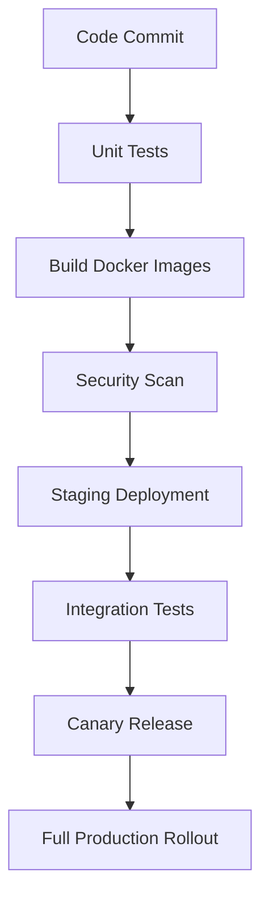

# EarnMax Elite Deployment Architecture

## Infrastructure Requirements

### Production Environment
```yaml
services:
  api_gateway:
    image: kong:3.4
    replicas: 3
    resources:
      limits:
        cpu: "2"
        memory: "2Gi"
    
  backend_services:
    user_service:
      image: earnmax/user-service:1.0
      replicas: 4
    vip_service:
      image: earnmax/vip-service:1.0
      replicas: 3
    transaction_service:
      image: earnmax/transaction-service:1.0
      replicas: 3
    task_service:
      image: earnmax/task-service:1.0
      replicas: 5
    referral_service:
      image: earnmax/referral-service:1.0
      replicas: 2

  databases:
    postgresql:
      image: postgres:15-alpine
      replicas: 2 (primary + standby)
      storage: 500Gi SSD
    redis:
      image: redis:7-alpine
      replicas: 3 (cluster mode)
```

## Configuration Management

### Environment Variables
```env
# Database Configuration
DB_HOST=postgres-cluster.internal
DB_PORT=5432
DB_NAME=earnmax_prod
DB_USER=earnmax_admin
DB_PASSWORD=secure_password

# Redis Configuration
REDIS_NODES=redis-1.internal:6379,redis-2.internal:6379,redis-3.internal:6379

# VIP Level Settings
VIP_LEVELS_CONFIG=/config/vip_levels.json
```

## Scaling Strategy

1. **Horizontal Scaling:**
   - API Gateway: Scale based on request rate (500+ RPS per instance)
   - User Service: Scale based on auth requests
   - Task Service: Scale during peak hours (10AM-6PM local time)

2. **Vertical Scaling:**
   - PostgreSQL: Upgrade instance size when connection pool >80% utilization
   - Redis: Add shards when memory usage >75%

## Security Considerations

1. **Network Security:**
   - VPC peering between services
   - Database access restricted to backend services only
   - Payment gateway communication over dedicated VPN

2. **Data Protection:**
   - Encryption at rest for all databases
   - TLS 1.3 for all service-to-service communication
   - Regular rotation of JWT signing keys

## Monitoring Setup

```yaml
monitoring:
  metrics_collection:
    interval: 15s
    exporters: [prometheus, statsd]
  
  alerts:
    - high_error_rate: 
        condition: error_rate > 5%
        duration: 5m
    - db_high_load:
        condition: cpu_usage > 85%
        duration: 10m
    - task_processing_lag:
        condition: pending_tasks > 1000
        duration: 30m
```

## CI/CD Pipeline

